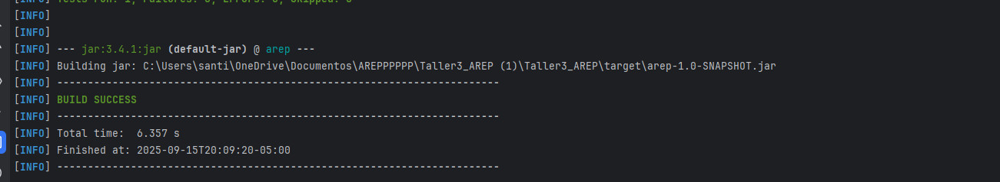
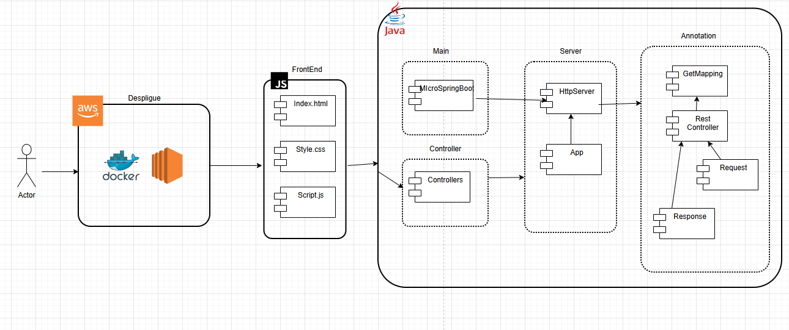
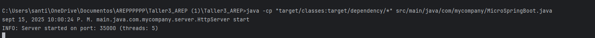
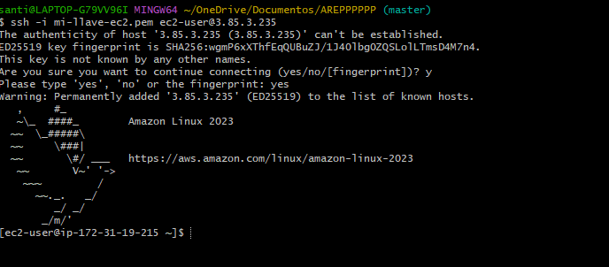
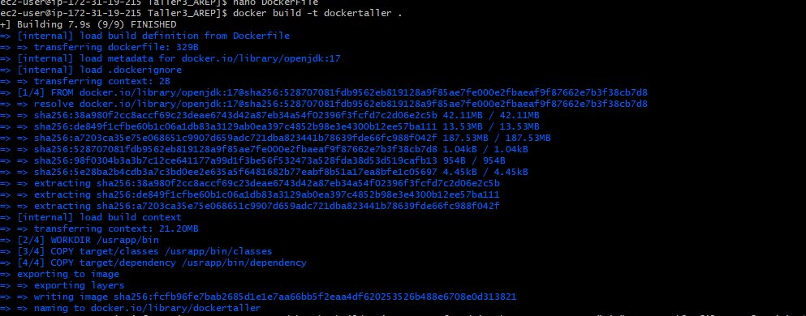
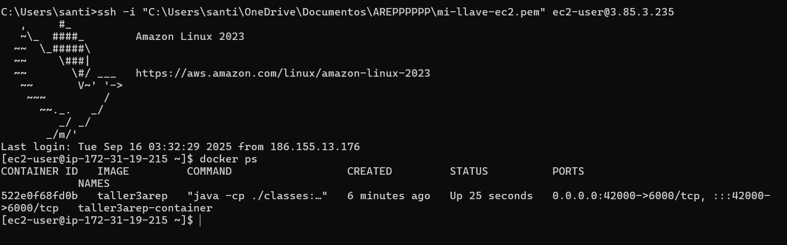
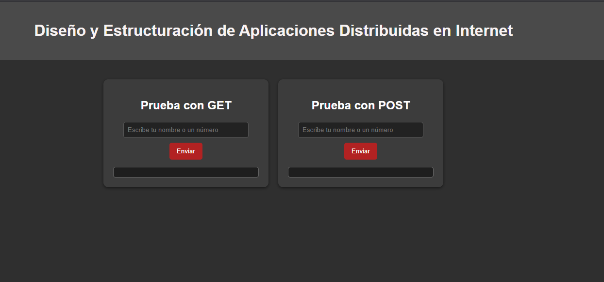

# Taller de de modularización con virtualización e Introducción a Docker

## Descripción del Proyecto

Este proyecto es una aplicación web Java que expone un servicio
REST simple. La aplicación responde a peticiones HTTP en el endpoint /greeting con un mensaje de
saludo personalizado. El proyecto está empaquetado usando Maven y se despliega dentro de un contenedor Docker, lo que permite ejecutarlo 
fácilmente en cualquier entorno, incluyendo instancias de AWS EC2.

---

## Instrucciones 

### Requisitos

- Asegúrate de tener Java - Git - Maven instalado en tu máquina. Puedes verificarlo ejecutando:
```
java -version
git --version
mvn -v
```


### Instalación
1. **Clonar el repositorio**
```bash
git https://github.com/YulienCC2512/AREP_Taller4.git
cd Taller4_AREP
```
    
2. **Construir el proyecto con Maven**

```bash
mvn clean package
```
- Verifiacion



 3. **Correr la aplicación**

- Probar funcionamiento corriendo dedse un editor de codigo la clase principal de MicroSpringBoot.java, o desde
  la linea de comandos:
```bash
  java -cp target/classes:target/dependency/* main.java.com.mycompany.MicroSpringBoot
```

4. **Probar el servicio**
   - Desde el navegador corre la url : http://localhost:35000 , desde la linea de comandos: 
```bash
  curl http://localhost:35000/hello
  curl http://localhost:35000/bye
  curl http://localhost:35000/
```

### Arquitectura del Proyecto



La arquitectura del sistema está organizada en **tres capas principales**:

1. **Despliegue (AWS + Docker)**
    - El servidor se empaqueta dentro de un contenedor **Docker**.
    - Se despliega en una instancia **AWS EC2**

2. **FrontEnd (HTML, CSS, JS)**

    - `index.html` → Estructura principal de la interfaz.
    - `style.css` → Estilos visuales.
    - `script.js` → Lógica de comunicación con el backend.

3. **Backend en Java**
    - **Main** → contiene la clase MicroSpringBoot, punto de entrada de la aplicación.
    - **Server** → clases HttpServer y App, responsables de manejar la concurrencia y las solicitudes entrantes.
    - **Controller** → controladores que procesan las peticiones HTTP.
    - **Annotations** → uso de anotaciones como `@RestController` y `@GetMapping` para mapear endpoints y manejar las respuestas.


### Despliegue en una Instancia de AWS EC2


- Utilizamos un comando para pasar las dependencias y crear el archivo .jar



- Nos conectamos utilizando la consola de git bash, para esto utilizamos el siguiente comando:
```
  ssh -i mi-llave-ec2.pem ec2-user@3.85.3.235
```


- Dentro de git bash posterior a al actualizacion de paquetes, instalamos docker, verificamos la version y creamos la imagen con el siguiente comando:
 
```
    sudo yum update -y
    sudo yum install docker
    sudo service docker start
    docker --version
    docker build -t arep-taller4 .
```

   - Creacion de imagen Docker:


- Luego de correr la imagen y verificar los archivos observamos el funcionamiento y la instancia corriendo:


```
    docker run -d -p 35000:35000 Taller4_AREP
    docker ps
```


- Abrimos el navegador y verificamos el funcionamiento utilizando la IP publica de la instancia:



### Evidencias
- El video se encuentra en el repositorio guardado como **Prueba-Funcionamiento.mp4**
 donde se puede ver el funcionamiento y el despliegue dentro AWS, ingresar al siguiente **video**:
    
  [Ver video Funcionamiento](./Prueba-Funcionamiento.mp4)

   


### Construido con:
- Java Sockets – para la comunicación de red

- Maven – para la gestión del proyecto

- IntelliJ IDEA 

---

## Autor
- Julian Santiago Cardenas 


    